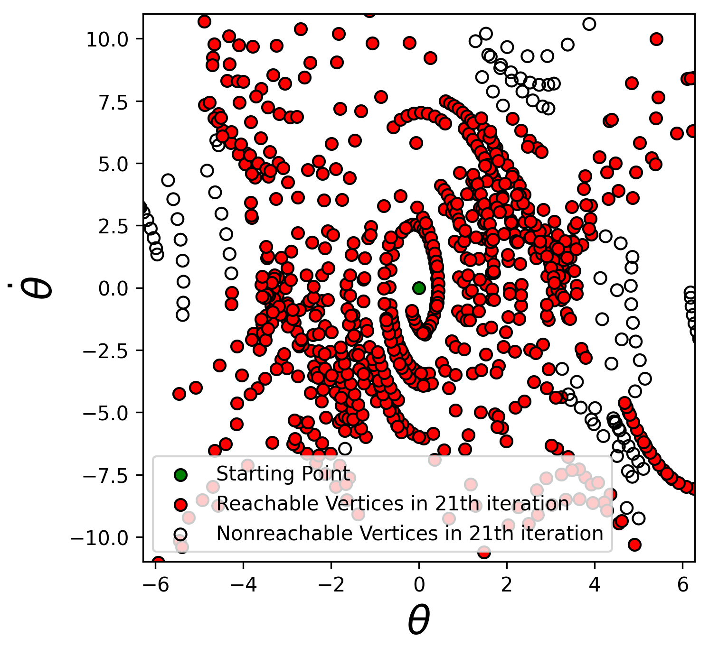

# LQR Funnel Graph for Kinodynamic Planning

> A course project of [MIT6.832 Underactuated Robotics](http://underactuated.csail.mit.edu/Spring2020/project.html) in 2020 Spring

Motion planning, combined with trajectory stabilization, is a typical route for robot feedback control. However, a new state is not guaranteed to reside within the stabilizable region, and replanning could be costly or even fail at runtime. One solution is to consider feedback when planning trajectories, called feedback motion planning. The guarantee of stabilization comes from a local Lyapunov function for the feedback law. A popular visualization is the funnel, i.e. at every state, there's always a funnel to guide and stabilize the motion. 

    

The paper, *LQR-trees: Feedback Motion Planning via Sums-of-Squares Verification*, leverages the SOS Programming to calculate the region of attraction (RoA) of the Lyapunov functions in a verifiable and effective way. This works for a fixed point and a trajectory as well, and thus a set of trajectories with verified RoA can be precomputed. As the number of trajectories increases, a large region around a fixed point could be fully covered. 

This project extends the idea from funnel-trees to funnel-graph. The destination is not fixed to be a point in state space. Therefore, a funnel-graph acts as a precomputed skill-set for a smooth dynamical system, and in runtime, new trajectories could be directly searched from the graph.

## Details

Please check my [report](./report/project_report.pdf).

## Presentation-Video

[Watch the video](https://www.youtube.com/watch?v=MIZTSZ0CJZA)

## Visualization-for-Funnel-Construction

The algorithm of funnel-graph is tested on a single pendulum. [Drake](https://drake.mit.edu/) is used to generate feasible trajectories in the state space, shown on the following left figure. The right hand side plots the corresponding verified funnels along the trajectories. The vertical axis is the inverse time to better illustrate the idea of funnel, and t'=1.0 is actually the start time.

    

After 120 iterations, the state space is highly covered.

  <tr>
    <td></td>
    <td></td>
  </tr>

Besides, the points in one trajectory may reside in the other trajectory's funnel. The following figure shows these interconnection by green arrows.

    

To check the capability of the above graph for future kinodynamic planning, the reachability of origin is checked through Depth First Search. The following figure reveals that although the origin hasn't appeared in the "skill-set", most region in the local state space is reachable.

<table>
  <tr>
    <td></td>
    <td></td>
    <td></td>
  </tr>
  <tr>
    <td> 1st iteration </td>
    <td> 11th iteration </td>
    <td> 21th iteration </td>
  </tr>
 </table>